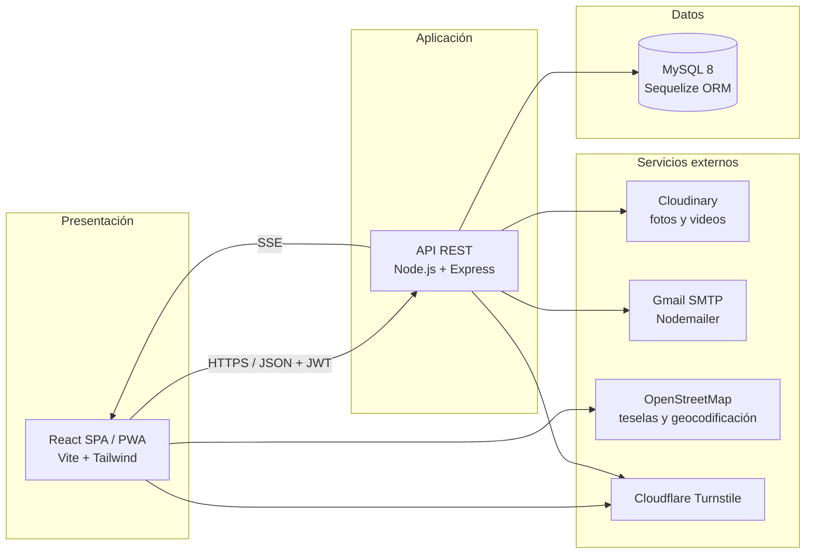

<h1 align="center">🐾 HuellaSegura</h1>

<h4 align="center">Prototipo de aplicación web para la localización y recuperación de mascotas perdidas en Pasto, Nariño</h4>

<p align="center">
  
  
  
  
  
</p>

Trabajo de grado — Programa de Ingeniería de Sistemas, Universidad Mariana (San Juan de Pasto).

---

## Contenido

- [Descripción y objetivo](#descripción-y-objetivo)
- [Funcionalidades](#funcionalidades)
- [Arquitectura](#arquitectura)
- [Tecnologías](#tecnologías)
- [Estructura del proyecto](#estructura-del-proyecto)
- [Requisitos](#requisitos)
- [Instalación y ejecución local](#instalación-y-ejecución-local)
- [Variables de entorno](#variables-de-entorno)
- [Base de datos](#base-de-datos)
- [API REST](#api-rest)
- [Pruebas](#pruebas)
- [Despliegue](#despliegue)
- [Documentación técnica](#documentación-técnica)
- [Autores](#autores)

---

## Descripción y objetivo

En Pasto no existe un canal centralizado y georreferenciado para reportar mascotas perdidas: los dueños dependen de carteles y de publicaciones dispersas en redes sociales.

**Objetivo general:** proponer una solución tecnológica que apoye la búsqueda y localización de mascotas perdidas en la ciudad de Pasto.

HuellaSegura reúne en una sola plataforma web (instalable como PWA) el registro digital de mascotas, la geolocalización de reportes en un mapa, las alertas por proximidad, la identificación con código QR, el directorio de entidades aliadas y la generación de documentos (cartel y reporte semanal en PDF).

**Actores:** propietario de mascota, ciudadano colaborador (puede reportar avistamientos sin crear cuenta) y administrador.

## Funcionalidades

| Requisito de la tesis | Funcionalidad |
|---|---|
| R1, R2 · HU-01 a HU-03 | Registro (nombre, correo, celular, contraseña ≥ 8), inicio de sesión con JWT (24 h) y cierre de sesión que invalida el token. Recuperación de contraseña por código al correo. |
| R3, R4, R5 · HU-05 a HU-08 | Registro y edición de mascotas en un formulario por pasos, hasta 5 fotos y 1 video (Cloudinary). |
| R6 · HU-09 a HU-12 | Reporte de pérdida en tres pasos: elegir la mascota, confirmar la ubicación (GPS o marcada en el mapa) y describir. Estados: en búsqueda, encontrada, cerrado. |
| R10 · HU-13 a HU-16 | Mapa interactivo (Leaflet + OpenStreetMap) con filtros por especie y fecha, ficha emergente y botón "Mi ubicación". |
| R8, R9 · HU-17 a HU-20 | Alertas por proximidad (fórmula de Haversine, radio configurable de 1 a 10 km): notificación interna, aviso en tiempo real (SSE) y correo. La ubicación solo se guarda con consentimiento. |
| R7, R11 · HU-21, HU-24 | Reporte de avistamiento con foto y GPS, sin necesidad de cuenta. El propietario recibe aviso inmediato. |
| HU-22, HU-23 | Código QR único por mascota (descargable en PNG) que lleva a un perfil público sin inicio de sesión. |
| HU-25 a HU-28 | Panel de administración: estadísticas, activación/desactivación de usuarios, moderación de reportes y gestión del directorio de entidades aliadas (también visibles en el mapa). |
| HU-29 a HU-31 | Compartir en Facebook y WhatsApp con vista previa, reporte semanal en PDF (automático cada lunes y bajo demanda) y cartel A4 en PDF con foto, datos y QR. |
| RNF-11 (Ley 1581 de 2012) | Autorización de tratamiento de datos al registrarse, perfil público con solo el primer nombre y el teléfono, retiro del consentimiento de ubicación y eliminación de la cuenta. |

La correspondencia completa requisito → código está en [docs/TRAZABILIDAD.md](docs/TRAZABILIDAD.md).

## Arquitectura

Arquitectura cliente-servidor en **tres capas** (monolito modular), tal como se plantea en la tesis:



Dentro del backend cada petición recorre: **rutas → middlewares (autenticación, rol, validación, archivos) → controladores → servicios → modelos**. Detalle en [docs/ARQUITECTURA.md](docs/ARQUITECTURA.md).

## Tecnologías

| Capa | Tecnologías |
|---|---|
| Frontend | React 18, Vite, Tailwind CSS 3, React Router 6, Leaflet / React-Leaflet, Axios, Framer Motion, qrcode.react, Sonner, vite-plugin-pwa |
| Backend | Node.js ≥ 18, Express 4, Sequelize 6 + sequelize-cli, mysql2, JWT, bcryptjs, express-validator, Helmet, express-rate-limit, Multer, Nodemailer, PDFKit, qrcode, node-cron |
| Datos | MySQL 8 |
| Servicios | Cloudinary, Gmail SMTP, OpenStreetMap / Nominatim, Cloudflare Turnstile |
| Calidad | Jest + Supertest (backend), Vitest + Testing Library (frontend), prueba E2E contra MySQL real, ESLint |

> Nota: la tesis menciona Bootstrap 5 para la interfaz; la implementación final usa **Tailwind CSS**.

## Estructura del proyecto

```
HuellaSegura/
├── backend/
│   ├── server.js                 # Arranque: valida entorno, conecta BD, programa tareas
│   ├── railway.json              # Configuración de despliegue (migra y arranca)
│   ├── migrations/               # 15 migraciones Sequelize (esquema completo)
│   ├── src/
│   │   ├── app.js                # Express: seguridad, CORS, rate limit, rutas, errores
│   │   ├── config/               # BD, JWT, Cloudinary, validación de variables de entorno
│   │   ├── routes/               # Definición de endpoints y validaciones de entrada
│   │   ├── middlewares/          # Autenticación/rol, subida de archivos, errores
│   │   ├── controllers/          # Orquestan cada caso de uso
│   │   ├── services/             # Lógica reutilizable: proximidad, correo, PDF, QR, tiempo real
│   │   ├── models/               # Entidades Sequelize y asociaciones
│   │   └── seeders/              # Creación del administrador inicial
│   └── tests/                    # unit/, integration/ y e2e/
├── frontend/
│   ├── src/
│   │   ├── pages/                # Pantallas (admin/ para el panel de administración)
│   │   ├── components/           # Componentes reutilizables (ui/ para los básicos)
│   │   ├── services/             # ÚNICO punto de acceso a la API
│   │   ├── context/              # Sesión (AuthContext) y notificaciones en tiempo real
│   │   ├── hooks/ providers/     # Geolocalización, tema claro/oscuro
│   │   └── config/               # Configuración del mapa
│   ├── tests/                    # Pruebas Vitest
│   └── vercel.json               # Configuración de despliegue del frontend
└── docs/                         # Arquitectura, base de datos, despliegue, trazabilidad, diseño
```

## Requisitos

- Node.js 18 o superior y npm
- MySQL 8 (local o en la nube)
- Cuentas en Cloudinary y Gmail (contraseña de aplicación) para fotos y correos
- Opcional: Cloudflare Turnstile (en desarrollo funciona con la clave de prueba)

## Instalación y ejecución local

```bash
git clone https://github.com/Juanportilla12/HuellaSegura.git
cd HuellaSegura
```

**Backend**

```bash
cd backend
npm install
cp .env.example .env          # completar con tus valores
npm run migrate               # crea todas las tablas en la BD indicada en .env
npm run dev                   # http://localhost:3001
```

La base de datos indicada en `DB_NAME` debe existir: `CREATE DATABASE huella_segura CHARACTER SET utf8mb4;`

**Frontend** (en otra terminal)

```bash
cd frontend
npm install
cp .env.example .env
npm run dev                   # http://localhost:5173
```

**Crear un administrador:** en producción se crea automáticamente al arrancar si se definen `ADMIN_EMAIL` y `ADMIN_PASSWORD`. En local, registra un usuario desde la app y cámbiale el rol:

```sql
UPDATE usuarios SET rol = 'admin' WHERE email = 'tu_correo@ejemplo.com';
```

No hay credenciales de prueba precargadas: cada instalación crea sus propias cuentas.

## Variables de entorno

Las plantillas son `backend/.env.example` y `frontend/.env.example`. Los archivos `.env` reales **nunca** se suben al repositorio.

**Backend**

| Variable | Descripción | Obligatoria |
|---|---|---|
| `PORT` | Puerto del servidor (por defecto 3001) | No |
| `NODE_ENV` | `development`, `test` o `production` | Sí |
| `DB_HOST`, `DB_PORT`, `DB_NAME`, `DB_USER`, `DB_PASSWORD` | Conexión MySQL | Sí |
| `JWT_SECRET` | Secreto de firma de tokens (≥ 32 caracteres aleatorios) | Sí |
| `JWT_EXPIRES_IN` | Vigencia del token (24h según RNF-06) | No |
| `CLOUDINARY_CLOUD_NAME`, `CLOUDINARY_API_KEY`, `CLOUDINARY_API_SECRET` | Almacenamiento de fotos y videos | En producción |
| `EMAIL_HOST`, `EMAIL_PORT`, `EMAIL_USER`, `EMAIL_PASS` | SMTP (Gmail con contraseña de aplicación) | En producción |
| `TURNSTILE_SECRET_KEY` | Verificación anti-bots del login (solo producción) | No |
| `FRONTEND_URL` | URL del frontend: CORS, enlaces de correos y QR | En producción |
| `ADMIN_EMAIL`, `ADMIN_PASSWORD`, `ADMIN_NOMBRE` | Administrador inicial | No |

El servidor no arranca si falta alguna variable obligatoria (`src/config/env.js`).

**Frontend**

| Variable | Descripción |
|---|---|
| `VITE_API_URL` | URL de la API, terminada en `/api` |
| `VITE_TURNSTILE_SITE_KEY` | Clave pública de Turnstile |

## Base de datos

Siete tablas: `usuarios`, `mascotas`, `reportes`, `avistamientos`, `notificaciones`, `entidades_aliadas` y `SequelizeMeta` (control de migraciones). El esquema se reconstruye desde cero con `npm run migrate` y se revierte con `npx sequelize-cli db:migrate:undo:all`.

Diagrama entidad-relación, claves e índices en [docs/BASE_DE_DATOS.md](docs/BASE_DE_DATOS.md).

## API REST

Base: `/api`. 🔒 = requiere `Authorization: Bearer <token>`; 👑 = solo administrador.

| Módulo | Endpoints |
|---|---|
| Autenticación | `POST /auth/register` · `POST /auth/login` · 🔒`POST /auth/logout` · 🔒`GET /auth/me` · `POST /auth/forgot-password` · `POST /auth/verify-reset-code` · `POST /auth/reset-password` |
| Usuario | 🔒`PUT /usuarios/perfil` · 🔒`PUT /usuarios/foto` · 🔒`PUT /usuarios/radio-alerta` · 🔒`PUT /usuarios/ubicacion` · 🔒`DELETE /usuarios/ubicacion` · 🔒`DELETE /usuarios/cuenta` |
| Mascotas | 🔒`GET/POST /mascotas` · 🔒`GET/PUT/DELETE /mascotas/:id` · 🔒`POST /mascotas/:id/fotos` · 🔒`POST /mascotas/:id/video` · 🔒`GET /mascotas/:id/qr` · 🔒`GET /mascotas/:id/cartel-pdf` |
| Reportes | `GET /reportes` (activos, público) · 🔒`GET /reportes/mis-reportes` · 🔒`POST /reportes` · 🔒`PUT /reportes/:id/estado` |
| Avistamientos | `POST /avistamientos` (público, foto opcional) |
| Perfil público | `GET /publico/mascotas/:id` · `GET /publico/compartir/mascotas/:id` (vista previa para redes) |
| Notificaciones | 🔒`GET /notificaciones` · 🔒`PUT /notificaciones/:id/leer` · 🔒`PUT /notificaciones/leer-todas` · 🔒`GET /sse/eventos` (tiempo real) |
| Entidades aliadas | `GET /entidades-aliadas` · 👑`POST` · 👑`PUT /:id` · 👑`DELETE /:id` |
| Administración | 👑`GET /admin/estadisticas` · 👑`GET /admin/usuarios` · 👑`PUT /admin/usuarios/:id/estado` · 👑`GET /admin/reportes` · 👑`PUT /admin/reportes/:id/moderar` · 👑`GET /admin/reportes/semanal-pdf` |
| Salud | `GET /health` |

## Pruebas

```bash
cd backend && npm test          # 190 pruebas unitarias y de integración (sin BD real)
cd frontend && npx vitest run   # 78 pruebas de componentes y páginas
```

**Estilo de código (ESLint):**

```bash
cd backend && npm run lint
cd frontend && npm run lint
```

**Prueba de extremo a extremo** (43 verificaciones de R1–R11 y RNF contra MySQL real). Con el backend corriendo sobre una base de datos de prueba:

```bash
cd backend && npm run test:e2e
```

Crea usuarios `@test.local`; **no la ejecutes contra producción**.

## Despliegue

- **Backend:** Railway (Railpack). `railway.json` ejecuta `npm run migrate && npm start` y usa `/health` como verificación.
- **Base de datos:** MySQL de Railway.
- **Frontend:** Vercel (`frontend/vercel.json`, build de Vite y reescritura de rutas a `index.html`).

Guía paso a paso en [docs/DESPLIEGUE.md](docs/DESPLIEGUE.md).

## Documentación técnica

- [docs/ARQUITECTURA.md](docs/ARQUITECTURA.md): capas, módulos, flujos y seguridad
- [docs/BASE_DE_DATOS.md](docs/BASE_DE_DATOS.md): modelo entidad-relación y migraciones
- [docs/TRAZABILIDAD.md](docs/TRAZABILIDAD.md): requisitos de la tesis → código
- [docs/DESPLIEGUE.md](docs/DESPLIEGUE.md): despliegue y verificación
- [docs/DESIGN_SYSTEM.md](docs/DESIGN_SYSTEM.md) y [docs/diseno/](docs/diseno/): sistema de diseño y capturas

## Autores

- Juan José Portilla Martínez
- Samuel Felipe Quintero Riobamba
- Víctor Felipe Rosas Burbano

Asesor: Mg. Danny Michael Cárdenas Martínez — Universidad Mariana, Facultad de Ingeniería.
