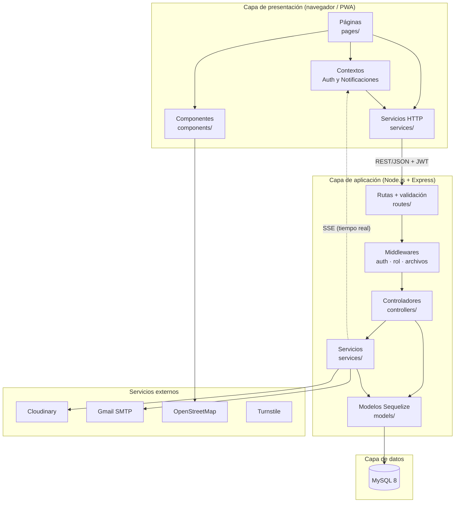
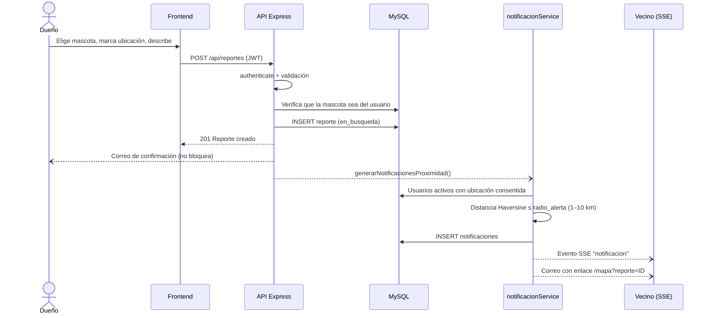
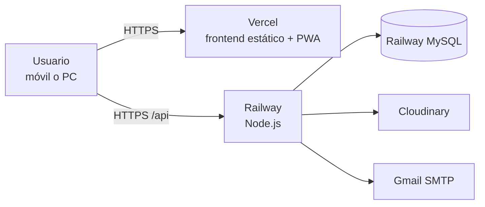

# Arquitectura de HuellaSegura

## 1. Decisión arquitectónica

HuellaSegura es un **monolito modular cliente-servidor en tres capas**: presentación (React), aplicación (API Express) y datos (MySQL), más servicios externos. Es la arquitectura de la Figura 22 de la tesis.

Por qué no microservicios: el sistema tiene un solo equipo, un solo dominio (mascotas perdidas), unos 45 endpoints y un volumen de prototipo para una ciudad. Separar en servicios añadiría despliegues, red y consistencia distribuida sin un beneficio medible. El monolito por capas es más fácil de mantener, desplegar en planes gratuitos y explicar.

## 2. Responsabilidades por carpeta

### Backend (`backend/src`)

| Carpeta | Responsabilidad | Ejemplos |
|---|---|---|
| `config/` | Configuración e infraestructura | Conexión Sequelize, JWT, Cloudinary, validación de variables de entorno |
| `routes/` | Contrato HTTP: método, URL, validaciones de entrada (`express-validator`) y middlewares de cada endpoint | `reporteRoutes.js` |
| `middlewares/` | Reglas transversales | `authenticate` + `requireAdmin`, `upload`/`uploadVideo`, manejador de errores |
| `controllers/` | Un caso de uso por función: valida, consulta modelos y llama servicios | `reporteController.crear` |
| `services/` | Lógica de negocio reutilizable o que habla con servicios externos | `notificacionService` (Haversine), `emailService`, `pdfService`, `qrService`, `tiempoRealService` (SSE), `reporteSemanalService` (cron) |
| `models/` | Entidades, validaciones de datos y asociaciones | `Usuario`, `Mascota`, `Reporte`, ... |
| `seeders/` | Datos iniciales | Administrador desde variables de entorno |

### Frontend (`frontend/src`)

| Carpeta | Responsabilidad |
|---|---|
| `pages/` | Una pantalla por ruta; `admin/` agrupa el panel de administración |
| `components/` | Piezas reutilizables (`MascotaCard`, `MapaSelector`, `BotonesCompartir`, `ui/BottomNav`, ...) |
| `services/` | **Único lugar que llama a la API** (axios con el token JWT); las páginas no usan `fetch`/`axios` directamente salvo la geocodificación pública de OpenStreetMap |
| `context/` | `AuthContext` (sesión) y `NotificacionesContext` (contador de no leídas, SSE, actualización de la ubicación consentida) |
| `hooks/`, `providers/` | Geolocalización del navegador y tema claro/oscuro |
| `config/` | Configuración del mapa (teselas OSM y centro de Pasto) |

## 3. Módulos funcionales

| Módulo | Backend | Frontend | Requisitos |
|---|---|---|---|
| Autenticación | `authRoutes`, `authController`, `authMiddleware` | `Login`, `Register`, `OlvideContrasena`, `AuthContext` | R1, R2, HU-01–03 |
| Mascotas | `mascotaRoutes`, `mascotaController`, Cloudinary | `MisMascotas`, `MascotaForm`, `PerfilMascota` | R3–R5, HU-05–08 |
| Reportes | `reporteRoutes`, `reporteController` | `CrearReporte`, `MisReportes`, `MapaPrincipal` | R6, R10, HU-09–16 |
| Alertas | `notificacionService`, `tiempoRealService`, `sseRoutes`, `notificacionController` | `NotificacionesContext`, `Alertas`, `ConfiguracionPerfil` | R8, R9, HU-17–20 |
| Avistamientos y QR | `avistamientoController`, `perfilPublicoController`, `qrService` | `ReportarAvistamiento`, `PerfilPublico`, `CarnetQR` | R7, R11, HU-21–24 |
| Administración y aliados | `adminController`, `entidadAliadaController` | `admin/*`, `Directorio`, mapa | HU-25–28 |
| Documentos y difusión | `pdfService`, `reporteSemanalService`, página Open Graph | `BotonesCompartir`, `MascotaCard`, `Dashboard` | HU-29–31 |

## 4. Flujo principal: reporte de pérdida con alertas por proximidad

Corresponde al diagrama de secuencia de la Figura 21 de la tesis.

Los correos y las notificaciones se envían en segundo plano: un fallo del SMTP no impide crear el reporte.

## 5. Autenticación y autorización

- Contraseñas con **bcrypt, costo 10** (RNF-05), aplicado por hooks del modelo `Usuario`.
- **JWT** firmado con `JWT_SECRET`, vigencia de 24 h (RNF-06). El payload incluye `tokenVersion`: el logout incrementa `token_version` en la BD y todos los tokens anteriores dejan de ser válidos (HU-03).
- `authenticate` verifica el token en el header `Authorization`, que el usuario exista, que el token no haya sido revocado y que la cuenta esté activa. Solo la ruta `/api/sse/eventos` acepta el token en la URL (EventSource no admite headers), y ese valor se oculta en los logs.
- `requireAdmin` restringe el panel de administración y la gestión de entidades al rol `admin`.
- Cada recurso privado se filtra por `usuario_id` del token (un usuario no puede ver, editar ni reportar mascotas ajenas).

## 6. Seguridad aplicada

| Riesgo | Medida |
|---|---|
| Secretos en el repositorio | `.env` ignorados; solo `.env.example`. El historial se limpió de un archivo con credenciales reales y de la contraseña del admin (ver informe). |
| Fuerza bruta | `express-rate-limit`: 100 peticiones/15 min por IP y 10 en `/api/auth`. Turnstile en el login en producción. |
| Enumeración de cuentas | Login y recuperación de contraseña responden igual exista o no el correo. |
| Inyección SQL | Consultas a través de Sequelize (parametrizadas); el seeder usa `replacements`. |
| XSS | React escapa la salida; los correos HTML y la página Open Graph escapan los datos de usuario. |
| Asignación masiva | Los controladores copian solo campos permitidos (p. ej. entidades aliadas). |
| Subida de archivos | Tipos MIME permitidos (JPG/PNG; MP4/WebM/MOV), límites de 5 MB y 30 MB, almacenamiento en memoria y envío a Cloudinary. |
| CORS | Solo `FRONTEND_URL` y los orígenes locales de desarrollo. |
| Cabeceras | Helmet. |
| Errores | En producción los errores 500 devuelven un mensaje genérico; los detalles quedan en el log del servidor. |
| CSRF | No aplica de forma directa: la API no usa cookies de sesión, el token viaja en un header que otro sitio no puede adjuntar. |
| Privacidad (Ley 1581) | Consentimiento explícito de datos y de ubicación; perfil público con primer nombre y teléfono, nunca el correo; retiro de la ubicación y eliminación de la cuenta con borrado en cascada. |

**Limitación conocida:** el token se guarda en `localStorage` (así lo define el DoD del Sprint 1). Un XSS podría leerlo; el riesgo se mitiga porque React escapa la salida y no se usa `dangerouslySetInnerHTML`.

## 7. Tiempo real y tareas programadas

- **SSE** (`tiempoRealService`): el servidor mantiene en memoria las conexiones abiertas de cada usuario (varias pestañas). Al ser memoria del proceso, funciona con una sola instancia del backend, que es la configuración del prototipo. Si se escalara a varias instancias habría que usar un bus de mensajes (p. ej. Redis).
- **Reporte semanal** (`reporteSemanalService`): `node-cron` genera el PDF cada lunes a las 7:00 (hora de Colombia) y lo envía a los administradores; también se descarga en cualquier momento desde el panel.

## 8. Infraestructura

Ver [DESPLIEGUE.md](DESPLIEGUE.md).
