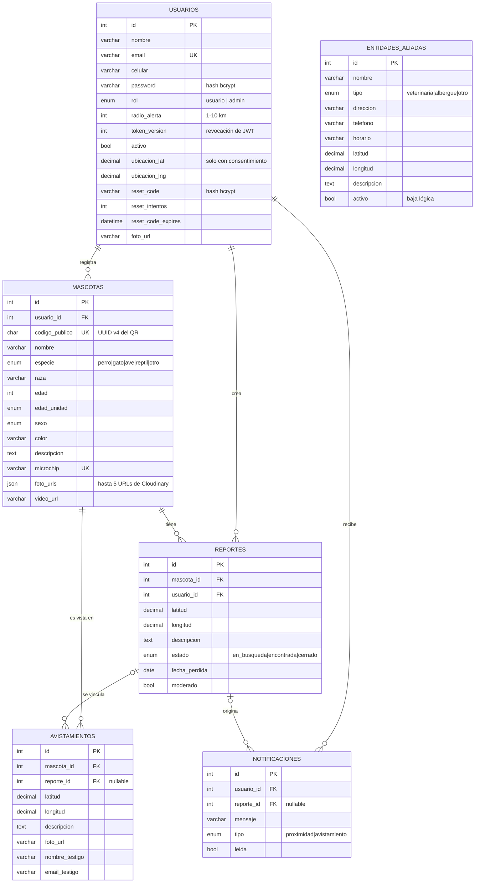

# Base de datos

MySQL 8, administrada con Sequelize. El esquema completo se crea **solo con migraciones** (`backend/migrations/`); los modelos (`backend/src/models/`) reflejan las mismas columnas.

```bash
npm run migrate                              # crear/actualizar el esquema
npx sequelize-cli db:migrate:undo:all        # revertir todo
```

Las 17 migraciones se probaron desde una base vacía en MySQL 8: se aplican, se revierten completas y se vuelven a aplicar sin errores.

## Modelo entidad-relación (implementado)



Todas las tablas tienen `created_at` y `updated_at`.

## Integridad referencial

| Relación | Al borrar el padre | Motivo |
|---|---|---|
| `mascotas.usuario_id → usuarios` | CASCADE | Eliminar la cuenta borra los datos del titular (Ley 1581). |
| `reportes.usuario_id → usuarios`, `reportes.mascota_id → mascotas` | CASCADE | Un reporte no existe sin su mascota ni su dueño. |
| `avistamientos.mascota_id → mascotas` | CASCADE | Igual que el anterior. |
| `avistamientos.reporte_id → reportes` | SET NULL | El avistamiento se conserva aunque se borre el reporte. |
| `notificaciones.usuario_id → usuarios` | CASCADE | Las notificaciones son del destinatario. |
| `notificaciones.reporte_id → reportes` | SET NULL | El aviso queda en el historial del usuario. Corregido por la migración 15 (ver abajo). |

## Índices

| Tabla | Índice | Uso |
|---|---|---|
| `usuarios` | `email` (único) | Login y registro |
| `mascotas` | `usuario_id`, `especie`, `microchip` (único), `codigo_publico` (único) | "Mis mascotas", filtro por especie |
| `reportes` | `estado`, `usuario_id`, `mascota_id`, `(estado, moderado, created_at)`, `(latitud, longitud)` | Mapa de reportes activos, "mis reportes", reporte semanal |
| `notificaciones` | `(usuario_id, leida)` | Panel y contador de no leídas |
| `avistamientos` | `mascota_id`, `created_at` | Historial y estadísticas del mes |

En la prueba E2E, el listado de reportes activos respondió en 19 ms (RNF-02 exige menos de 500 ms).

## Historial de migraciones

| # | Migración | Cambio |
|---|---|---|
| 1–3 | create-usuarios, create-mascotas, create-reportes | Tablas base (Sprints 1–3) |
| 4 | add-ubicacion-to-usuarios | Última ubicación conocida para alertas |
| 5–6 | create-notificaciones, create-avistamientos | Sprints 5–6 |
| 7 | make-reporte-nullable-in-notificaciones | `reporte_id` opcional con SET NULL |
| 8 | add-moderado-to-reportes | Moderación (HU-28) |
| 9 | create-entidades-aliadas | Directorio (HU-27) |
| 10 | add-reset-code-and-foto-to-usuarios | Recuperación de contraseña y foto de perfil |
| 11 | add-celular-to-usuarios | R1: celular |
| 12 | add-horario-to-entidades-aliadas | HU-27: horario de atención |
| 13 | add-video-to-mascotas | R5: video |
| 14 | add-indices-consultas | Índices del Sprint 9 |
| 15 | fix-fk-duplicada-notificaciones | Corrige el resultado de la migración 7 |
| 16 | reset-code-cifrado-e-intentos | Código de recuperación cifrado (bcrypt) y máximo 5 intentos |
| 17 | add-codigo-publico-to-mascotas | Código público aleatorio (UUID v4) para el QR y los enlaces: los perfiles no se pueden recorrer por id |

**Sobre la migración 15:** la migración 7 intentaba borrar la clave foránea `notificaciones_ibfk_3`, pero MySQL la había creado como `notificaciones_ibfk_2` y el error se ignoraba. `reporte_id` quedaba con dos claves (CASCADE y SET NULL) y prevalecía CASCADE. La migración 7 no se modificó porque ya estaba aplicada en producción; la 15 elimina la clave sobrante sin depender de su nombre.

## Decisiones de diseño y diferencias con el diagrama de la tesis

1. **Imágenes:** la Figura 19 de la tesis tiene una entidad `Imagen`. La implementación guarda las URLs de Cloudinary en `mascotas.foto_urls` (JSON, máximo 5) y el video en `mascotas.video_url`. Las imágenes no tienen atributos ni relaciones propias, se leen siempre junto con la mascota y Cloudinary es su almacenamiento real; una tabla aparte solo añadiría un JOIN. **Recomendación:** actualizar la Figura 19 con este modelo.
2. **Avistamientos:** la tabla `avistamientos` (R7, R11) no aparece en la Figura 19. **Recomendación:** agregarla al diagrama.
3. **`reportes.usuario_id`** repite el dueño de la mascota. Se mantiene para filtrar "mis reportes" sin JOIN; el controlador garantiza que siempre coincide (solo el dueño puede crear el reporte).
